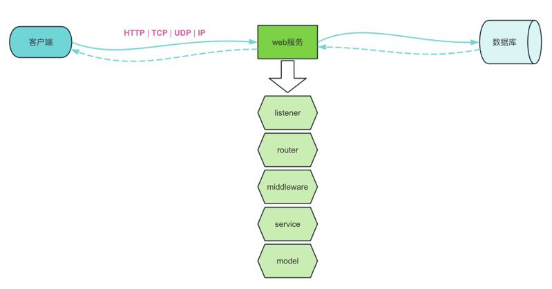
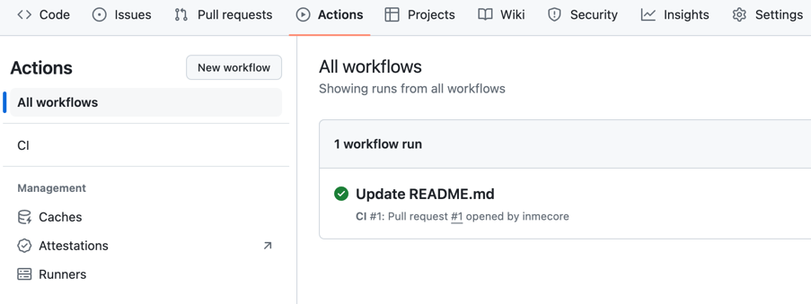

# 简单自动化测试用例

## 简介
1. 这是一个简单的HTTP自动化测试案例，目的在于学习和研究如何实现一个HTTP服务的自动化测试。
2. 因为只是简单完成测试，所以，本例不涉及数据库、缓存、消息队列等中间件。代码中涉及使用的地方均以全局变量代替。
3. 为了快速搭建和使用，本例以`gin`框架作为基础构建。
4. 为了方便理解整个流程，本例并未采用过多的自动化构建工具。
5. 代码中可能出现性能问题甚至错误，有的是为了快速实现流程而忽略，有的是考虑不周，欢迎指出、更正或忽略。

## 正文
### 一、先来看结果
正确的结果：
```
PASS
coverage: 55.9% of statements in ./...
ok      tests/test      0.659s  coverage: 55.9% of statements in ./...
```
执行运行命令，`go test -v ./test/... -gcflags=all=-l  -coverpkg=./... -coverprofile=coverage.out`得到以上结果，结果中包含测试结果、运行时间、代码覆盖率。 其中，

1. `PASS`代表所有测试均运行通过，如果失败为`FAIL`。
2. `ok`代表状态
3. `tests/test`是本例的测试文件夹
4. `0.659s`是测试所耗时间
5. `55.9%`测试的代码覆盖率。

如果失败，结果如下：
```
FAIL
coverage: 57.2% of statements in ./...
FAIL    tests/test      1.646s
FAIL
```

### 二、详情
现在结果有了，接下来我们就来看一个完整测试是怎么一步一步得到的吧。
<div align="center"></div>

#### 基础
一个完整的请求，从客户端开始，发起网络请求，到服务处理，查询处理数据，最后返回结果。由此，我们的测试覆盖到这几个环节，那基本上很少出问题了。</br>
在进入代码之前，我们得先搞清楚一些测试用例的一些基础知识。

1. 用例内容：标题、前置条件、测试步骤、预期结果。
2. 设计原则：独立性、可重复、最小化、文档化、……
3. 用例作用：验证、回归、文档化、临界避险……

#### 简单用例
了解上述前提之后，接下来就可以进入代码了，先来看一个简单的测试用例：
```go
func TestHelloWorld(t *testing.T) {
	var exec = func(name string) string {
		return fmt.Sprintf("Welcome! %s!", name)
	}
	tests := []struct {
		name string
		in   string
		want string
	}{
            {
                name: "Print HelloWorld",
                in:   "HelloWorld",
                want: "Welcome! HelloWorld!",
            },
            {
                name: "Print HelloWorld Empty",
                in:   "",
                want: "Welcome! !",
            },
            {
                name: "Print HelloWorld Chinese",
                in:   "张三",
                want: "Welcome! 张三!",
            },
	}
	for _, tt := range tests {
		t.Run(tt.name, func(t *testing.T) {
			result := exec(tt.in)
			assert.Equal(t, tt.want, result)
		})
	}
}
```
此用例基本满足上面的基础信息，struct包含了名称`name`，前提条件`in`，测试步骤`exec`函数（即待测试方法），预期结果`want`，变量`tests`为数组是因为测试一般需要考虑很多情况，如临界值。</br>
由此，我们可以知道一般方法的简单测试用例，就可以这么实现，如本例中的“类型转换”用例 [TestConvert](https://github.com/inmecore/tests/blob/b0fbf0b6b819c7879047232fd736468a6fe7e200/test/utils_test.go#L35)。</br></br>

#### HTTP用例
那么，对于一个http测试用例，除了以上基础字段外，还有哪些呢？</br></br>
简单来说，除了名称，入参，出参外，还需要请求方式，请求路径，状态码等等，其中，前提条件除了包括请求参数，还包括请求头信息。这样就可以基本整理出用例的结构体了：
```go
// 请求参数
type in struct{}
// 响应结果
type want struct{}

tests := []struct {
		name   string
		method string
		path   string
		status int
		in     in
		want   want
	}{}
```
现在，我们就以“用户登录”为例来进行说明。 [TestUserLogin](https://github.com/inmecore/tests/blob/b0fbf0b6b819c7879047232fd736468a6fe7e200/test/user_test.go#L10)</br>
首先，本例是基于gin框架的写的服务，所以，需要有一个gin的上下文`gin.Context`，可以使用`gin.CreateTestContext(w)`来生成一个测试的上下文，w是http的ResponseWriter，可以用`httptest.NewRecorder()`来生成，这样也就有上下文了，上下文的作用就是贯穿本次执行的全过程以及生命周期。每次执行都需要一个新的上下文，因此可以把这部分逻辑写成个方法`setup`，用来获取新的上下文。
```go
func setup() (*gin.Context, *httptest.ResponseRecorder) {
	w := httptest.NewRecorder()
	c, _ := gin.CreateTestContext(w)
	return c, w
}
```
要发起一个http请求，还需要一个http客户端，可以使用`httptest.NewRequest(method,path,body)`得到，</br>
至于参数，有三种类型的参数，一种是在query上`?key=value`，一种是在param中`/:id/:name`，一种则是body，这些参数都可以从`in`中获取。</br>
query参数可以使用google的go-querystring工具得到，使用方式是给字段打上url标签：
```go
v, _ := query.Values(struct {
		Id   int    `url:"id"`
		Name string `url:"name"`
		Lock bool   `url:"lock"`
	}{
		Id:   1,
		Name: "test",
		Lock: false,
	})
query := v.Encode()
// output id=1&lock=false&name=test
```
本例为了方便处理，query,param,body均只采用json标签，反射获取标签值赋值到对应参数上。
```go
// id=1&lock=true&name=test&key4=&key5=...
func query(data any) string {
	var q string
	t := reflect.TypeOf(data)
	v := reflect.ValueOf(data)
	for i := 0; i < v.NumField(); i++ {
		key := t.Field(i).Tag.Get("json")
		value := v.Field(i)
		q += fmt.Sprintf("%s=%v&", key, value)
	}
	q, _ = strings.CutSuffix(q, "&")
	return q
}
```
```go
// eg: /:id/:name to /1/test
func params(path string, data any) string {
	t := reflect.TypeOf(data)
	v := reflect.ValueOf(data)
	re := regexp.MustCompile(`:(\w+)`)
	matches := re.FindAllStringSubmatch(path, -1)
	for _, match := range matches {
		for i := 0; i < t.NumField(); i++ {
			key := t.Field(i).Tag.Get("json")
			value := v.Field(i).String()
			if key == match[0][1:] {
				old := fmt.Sprintf("/:%s", key)
				news := fmt.Sprintf("/%s", value)
				path = strings.Replace(path, old, news, 1)
				break
			}
		}
	}
	return path
}
```
body处理比较简单，`json.Marshal(data)`就可以得到。将参数添加到请求中：
```go
func request(c *gin.Context, method string, path string, data any) {
    _data, _ := json.Marshal(data)
    path = params(path, data)
    q := query(data)
    
    c.Request = httptest.NewRequest(method, path+"?"+q, bytes.NewBuffer(_data))
    c.Request.Header.Add("Content-Type", gin.MIMEJSON)
}
```
请求构建就算完成了。</br>

前提条件准备就绪之后，就是测试步骤了，说白了，就是发起请求，使用`r = router.New()`，`r.ServeHTTP(w, c.Request)`发起请求，等到请求响应。
最后，处理响应结果，对预期结果进行判断，完整流程：
```go
t.Run(tt.name, func(t *testing.T) {
	// 前提条件
    c, w := setup(false)
    before(c, tt.method, tt.path, tt.in)
	
	// 测试过程
    r.ServeHTTP(w, c.Request)
    
	
	// 预期结果
    assert.Nil(t, c.Err())
    assert.Equal(t, tt.status, w.Code)
    
    var data want
    assert.Nil(t, json.Unmarshal(w.Body.Bytes(), &data))
    assert.Equal(t, tt.want, data)
})
```

然而，实际开发中还会有很多情况需要考虑，如何使用中间件（数据库，缓存，第三方API，消息中间件等），函数返回值会受时间和环境等因素影响，等等，这些都有可能违背测试的“设计原则”，为了解决这个问题，我们就需要考虑 mock 或者 monkey 这样的手段来避免了。</br>
本例中，使用`jwt`签名的函数就会受时间因素影响，时间不同结果不同，就会造成用户每次登录拿到的token都不一样，没法验证预期结果。因此我们需要固定时间，保证任何时候发出的请求时间都是一致的。
```go
func TestUserLogin(t *testing.T) {
    now := time.Date(2024, 1, 2, 3, 0, 0, 0, time.UTC)
    patch := gomonkey.ApplyFunc(time.Now, func () time.Time { return now })
    defer patch.Reset()
    // ...
}
```
mock和monkey的原理和使用本例就不展开了。

至此，测试用例算是完成了。

### 三、CI 自动化
自动化其实就是git的工作流，我们常用的工作流有pr，ci，cd。详情可见 [github-flow](https://docs.github.com/en/get-started/using-github/github-flow)

编写yaml文件，本例ci实现了分支合并到`main`之后，自动执行测试用例。
```yaml
# This workflow will build a golang project
# For more information see: https://docs.github.com/en/actions/automating-builds-and-tests/building-and-testing-go

name: CI

on:
  pull_request:
    branches: [ "main" ]

jobs:

  build:
    runs-on: ubuntu-latest
    steps:
      - uses: actions/checkout@v3

      - name: Set up Go
        uses: actions/setup-go@v3
        with:
          go-version: 1.21

      - name: Test
        env:
          CONFIG: ${{ github.workspace }}/.env.ci
        run: go test -v ./test/... -gcflags=all=-l  -coverpkg=./... -coverprofile=coverage.out
```
CI 执行结果可在菜单Actions中查看：
<div align="center"></div>

综上所述，一个自动化测试用例由此而来。
